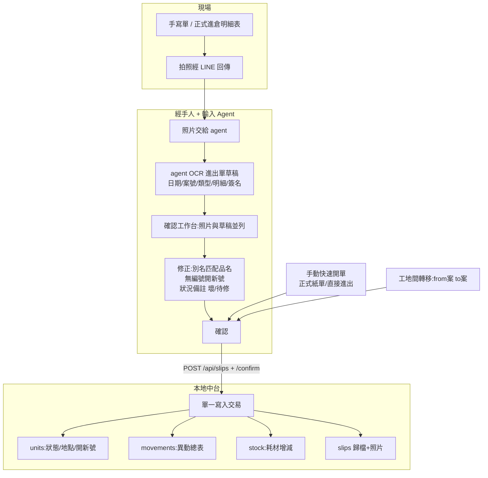
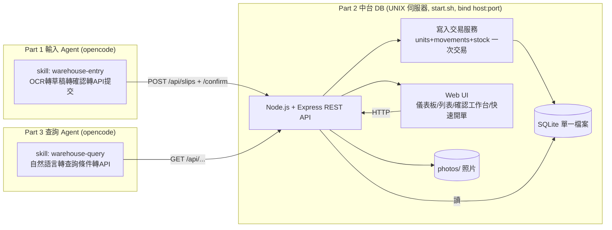
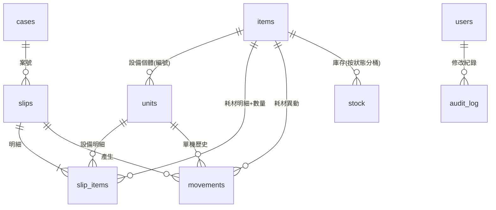

# A倉庫進出倉管理系統（Warehouse）

設備與數量類物料的進出倉登記系統。本檔為完整設計記錄，可作為實作（或其他類似專案）的依據。

> **命名規則**：英文/代碼/路徑用 `warehouse`（skill 名、API 路徑、DB 檔名）；中文顯示名稱為 **設備管理系統**。Skill 提示詞中須註明此對應。
> **界面風格規範**：所有 UI（含儀表板、列表、確認工作台、快速開單）須遵循 `design.md` 所載之風格規範（配色、字體、佈局、元件、響應式規則）。
> 設計日期：2026-08-29　固化日期：2026-08-30　狀態：**全部完成並固化** — Part 2 中台 100% / Part 1 輸入 skill 驗證通過 / Part 3 查詢 skill 驗證通過 / 照片 API 實測通過
> 技術棧：Node.js + Express + SQLite，部署 UNIX 伺服器，綁定 `127.0.0.1:8088`（可改）
> 配套規格：`docs/superpowers/specs/2026-08-29-warehouse-system-design.md`　實施計劃：`PLAN.md`　使用手冊：`MANUAL.md`
> 現有資料：`2026年資產明細表08-11.xls`（主檔）、`2025二重管進出紀錄(最新版).xlsx`、`2024.3~2025.6雙簧塞進出紀錄.xlsx`、`1.jpg~10.jpg`（進出倉原始單據照片）

---

## 目錄

1. [背景與現狀問題](#1-背景與現狀問題)
2. [設計目標](#2-設計目標)
3. [三部分架構](#3-三部分架構)
4. [角色](#4-角色)
5. [整體工作流程](#5-整體工作流程)
6. [系統架構圖](#6-系統架構圖)
7. [資料模型](#7-資料模型)
8. [API 規格](#8-api-規格)
9. [UI 畫面](#9-ui-畫面)
10. [Agent Skill（Part 1 輸入 / Part 3 查詢）](#10-agent-skillpart-1-輸入--part-3-查詢)
11. [關鍵規則](#11-關鍵規則)
12. [資料遷移](#12-資料遷移)
13. [備份與維運](#13-備份與維運)
14. [實施順序](#14-實施順序)
15. [驗證計劃](#15-驗證計劃)
16. [設計決策紀錄（訪談結論）](#16-設計決策紀錄訪談結論)
17. [實作進度與專案結構](#17-實作進度與專案結構)

---

## 1. 背景與現狀問題

現行以 `2026年資產明細表08-11.xls` 登記，含 15 張工作表：代碼、總明細表、異動總表明細（11k 筆）、二重管、雙簧塞、SP4耗材、安衛交通器材、套管、其它管材、其它鐵材設備、施工架、二重管-舊、灌注鐵管-舊、套管-舊、材料。

### 1.1 現有資料結構

| 工作表 | 內容 | 規模 |
|---|---|---|
| 代碼 | 4 層分類代碼樹（Ⅰ 大類-Ⅱ-Ⅲ-Ⅳ＋字母代碼），如「機具設備E/修補類F/止漏類I/高壓灌注機A」 | 145 列 |
| 總明細表 | 資產主檔——每台設備一列：流水號、代碼品名、代碼編號（E-F-I-A-01）、品名、規格、數量、價格、購買日期、保管人、轉出日期、轉借人、放置地點、備註、財編 | 1409 列 |
| 異動總表明細 | 異動帳冊——同一結構＋轉借日期/轉借人/轉借地(案號)/轉出日/轉借出人/轉借保管地(案號) | 11421 列 |
| 二重管/雙簧塞/SP4耗材 | 耗材庫存以 +/- 數量管理，含原庫存量與結餘 | 各表獨立 |
| 材料 | 數量類物料（米袋、帆布、高壓管等） | 531 列 |

### 1.2 原始單據來源（1.jpg~10.jpg 實例）

- **正式進倉明細表/物料債務務申請表**（1.jpg、3.jpg）：有結構，打勾項才登記；現場工程師簽名。1.jpg 第39項鑽堡抽水機標「21」＝明細表「鑽機#21」；第62項洗網機打勾但無編號。
- **現場手寫紙本拍照回傳**（2.jpg~10.jpg）：無固定格式、字跡難判讀；出倉與回倉可能寫同張；A 工地直轉 B 工地（10.jpg）；故障需寫備註（6.jpg 發電機#34 無法啟動）。

### 1.3 痛點

| 問題 | 說明 |
|---|---|
| 資料來源混亂 | 正式表/手寫單/工地間轉移，格式不一，登記時需逐一判讀 |
| 設備識別不一致 | 名稱不一致（洗網機=洗車機）、編號磨損無法辨識、無號設備無規則 |
| 異動紀錄不完整 | 只登記最新狀態，不複製到異動總表，無法回溯完整流動軌跡 |
| 耗材分散管理 | 二重管/雙簧塞獨立建檔，但進出資訊散落各單據，需重複判讀同一張紙 |
| 故障無專屬欄位 | 只能寫備註，無法快速篩選待修/報廢 |

---

## 2. 設計目標

- **快速進出倉**：完整物料清單，使用者能快速記錄（日期/案號/設備），方便建立進出單
- **數位化單據**：照片經 OCR 確認為標準格式後自動寫入，取代手動判讀
- **完整流動軌跡**：一次寫入同時更新主檔狀態＋異動紀錄＋庫存，不再手動複製
- **儀表板與報表**：隨時觀察庫存變化、產生報表
- **自然語言查詢**：經手人/現場用自然語言查找資料
- **單一使用者**：登入後 API 不做權限限制，不區分角色（見 8.0 認證）
- **UNIX 伺服器部署**：中台部署於 UNIX 伺服器，綁定 host:port（開發 `127.0.0.1:8088`）

---

## 3. 三部分架構

系統分為三個獨立協作部分。**Part 2 中台不依賴任何 agent，可獨立運作**；Part 1 與 Part 3 透過同一組 REST API 與 Part 2 溝通。

| 部分 | 位置 | 職責 | 實作形態 |
|---|---|---|---|
| **Part 1 輸入 Agent** | opencode（AI Agent 平台） | 手寫單照片 OCR → 確認為標準格式 → 調度 API 提交記錄到中台 | **Skill**（`warehouse-entry`），非編譯程式，可跨 agent 平台 |
| **Part 2 中台 DB** | UNIX 伺服器（獨立服務） | 獨立資料庫，接受網頁與 API 呼叫；記錄所有庫存器材與每次進出；完整儀表板 | **程式**：Node.js + Express + SQLite，綁定 host:port（開發期 `127.0.0.1:8088`，未來改伺服器 IP），`start.sh` 啟動 |
| **Part 3 查詢 Agent** | opencode（AI Agent 平台） | 自然語言建立查找條件 → 呼叫查詢 API → 整理結果回覆 | **Skill**（`warehouse-query`），非編譯程式 |

### 設計原則：Skill vs 程式

- **Skill 是可移植的指令文件**（`SKILL.md`），不是編譯程式——任何具備視覺（OCR）與工具呼叫（HTTP API）能力的 agent 運行環境載入後都能執行。
- 真正寫成「程式」的只有 **Part 2 中台**。Part 1 與 Part 3 是 skill，可跨 agent 平台復用。
- 相依性：執行 skill 的 agent 必須支援圖片視覺判讀與 HTTP 請求工具。

---

## 4. 角色

| 角色 | 行為 |
|---|---|
| 現場人員 | 手寫單/正式明細表拍照，經 LINE 回傳給經手人 |
| 經手人（單一使用者） | 確認 OCR 草稿、手動開單、修改紀錄（audit_log）、自然語言查詢 |
| 輸入 Agent（Part 1） | 照片 OCR → 草稿 → 確認後 API 寫入 |
| 查詢 Agent（Part 3） | 自然語言 → 查詢 API → 結果整理 |

> 單一使用者（`admin`），需登入（見 8.0 認證），無角色區分；登入後 API 不做權限限制。`audit_log` 保留供事後追溯修改。

---

## 5. 整體工作流程



### 流程 A：照片進出倉（主流程）
1. 現場拍 handwritten/正式單 → LINE 回傳
2. 經手人把照片交給輸入 Agent（opencode）
3. Agent OCR → 進出單草稿（日期/案號/類型/明細[品名,數量,編號,狀況]/簽名人）
4. 確認工作台：照片↔草稿並列；修正別名匹配、無編號開新號、狀況備註
5. 確認 → Agent `POST /api/slips` + `/confirm` → 單一交易寫入 units/movements/stock/slips
6. 歸檔可追溯（含照片）

### 流程 B：手動快速開單
類型 tabs＋案號 autocomplete＋日期＋借用人；明細 autocomplete（別名/編號命中），Enter 新增、可批次貼上。儲存走同一寫入交易。

### 流程 C：工地間轉移
單類型=轉移，明細帶 from案→to案，不經倉庫庫存（總量不變）。

### 流程 D：管理後台
儀表板（在庫/在外/待修/低庫存/最近異動）、報表（期間/案號/類型 → CSV）、單機歷史卡、修改紀錄留 audit_log。

---

## 6. 系統架構圖



- **Part 1（輸入）**：手寫單照片 → Agent OCR 成草稿 → 經手人確認 → `POST /api/slips` + `/confirm` 寫入中台。
- **Part 2（中台）**：獨立 SQLite 資料庫，部署於 UNIX 伺服器，綁定 host:port（開發期 `127.0.0.1:8088`）；同時服務網頁 UI 與 REST API；記錄所有庫存與進出；儀表板觀察變化。API 不做權限限制。
- **Part 3（查詢）**：經手人/現場用自然語言描述條件 → 查詢 Agent 解析為 GET API 參數 → 呼叫查詢 API → 整理回覆。

---

## 7. 資料模型



### SQLite Schema

```sql
-- 物料主檔（設備＋數量類耗材合一）
-- 耗材 SKU 建模：每個(品名+規格)組合 = 一條 items 列
--   例：二重管 3M / 二重管 1.5M / 二重管 3M-待修 各為獨立 items 列
items(id PK, kind CHECK('equipment','consumable'),
      cat1, cat2, cat3, cat4, code,          -- 沿用 Ⅰ-Ⅱ-Ⅲ-Ⅳ 代碼體系
      name, aliases, spec, unit, price, note)

-- 設備個體（僅 equipment；耗材無 unit）
units(id PK, item_id FK, serial,             -- 編號 #21
      status CHECK('in_stock','out','repair','scrapped','lost','out_pending_cleanup'),
      location,                              -- 放置地點（倉庫/案號）
      custodian,                             -- 保管人/轉借人（目前持有者，遷移自主檔快照）
      last_transfer_date,                    -- 轉出日期（遷移自主檔快照；之後由異動更新）
      purchase_date, property_no)

-- 進出單頭
slips(id PK, no,                             -- 單號 S-2026-0001
      type CHECK('out','in','return','transfer','scrap','repair_out','repair_back'),
      date, case_no,                          -- 案號（轉移=來源案號A）
      to_case_no,                             -- 轉移目的地案號（僅 transfer）
      borrower,                               -- 借用人/接收人（轉移=B 案場負責人）
      from_person,                            -- 移交人（僅 transfer，A 案場負責人）
      confirmer,
      source CHECK('ocr','manual'),
      status CHECK('draft','confirmed'),
      note, created_at)

-- 進出單明細（一張單多列）
slip_items(id PK, slip_id FK, item_id FK, unit_id NULL FK,
           qty, from_loc, to_loc, condition_note, new_serial BOOL,
           batch_no)                        -- 批號/lot（如雙簧塞 03439白，可選）

-- 異動紀錄（＝現「異動總表明細」，自動產生）
movements(id PK, slip_id FK, item_id FK, unit_id NULL,
          type, date, qty,                   -- 數量（設備=1，耗材=進出數量）
          from_loc, to_loc,
          person,                            -- 經手人/接收人
          from_person,                       -- 移交人（轉移用）
          to_person,                         -- 接收人（轉移用）
          note)

-- 耗材庫存（按狀態分桶；同一 item 可有 good/repair/scrapped 三桶）
stock(item_id PK/FK, condition CHECK('good','repair','scrapped'), qty,
      safety_qty,                            -- 安全庫存（低庫存警示用）
      PRIMARY KEY(item_id, condition))

-- 案場主檔
cases(case_no PK, name, status)

-- 單一操作者（無角色區分、無密碼；audit_log 記錄用）
users(id PK, operator)

-- 修改紀修改紀錄（舊值→新值）
audit_log(id PK, user_id FK, tbl, row_id, changed_at, old_json, new_json)
```

### 欄位說明

| 表 | 用途 | 對應現有 Excel |
|---|---|---|
| `items` | 物料主檔：類型、分類代碼、品名、規格、**別名**（洗網機=洗車機）、單位、價格。耗材每個(品名+規格)＝一列 | 代碼＋總明細表＋材料表＋各耗材表每列 |
| `units` | 設備個體：編號、狀態、目前地點、**保管人**、**轉出日期**、購買日期、財編 | 總明細表每列一機 |
| `slips`/`slip_items` | 進出單：類型、日期、案號、借用人、來源、照片。明細可帶**批號**（雙簧塞編號） | 照片＝一張單；估價單出/回 |
| `movements` | 異動紀錄：日期、類型、from、to、經手人、關聯單號 | 異動總表明細 |
| `stock` | 耗材庫存：按**狀態分桶**（good/repair/scrapped），同規格可分可用與待修 | 二重管/雙簧塞表（含待修列） |
| `cases` | 案場：案號、案名 | 散落各處 |
| `audit_log` | 修改紀錄 | 無（新增） |

**別名匹配**：`items.aliases` 以分隔字串存（如 `洗網機,洗車機`），autocomplete 與 Agent 共用同一映射。

**耗材 SKU 建模**：Excel 的耗材表為樞紐格式（每欄＝一個品名+規格 SKU）。系統中每個(品名+規格)組合為一條獨立 `items` 列，例如「二重管 3M」「二重管 1.5M」「電纜線 5M²3芯」各為獨立列。一張進出單的多筆明細（`slip_items`）對應樞紀表一行的多欄。

---

## 8. API 規格

### 8.0 認證（Authentication）

除 `GET /api/health` 外，**所有路由（含靜態頁面、`/photos`）皆需認證**。

- **單一使用者**：`admin`，密碼硬編碼於 `src/auth.js`（`ADMIN_USER`/`ADMIN_PASS`，現為 `Jines2355`）。登入後無權限分級，所有記錄可看可改。
- **瀏覽器**：`/login.html` 登入頁 → `POST /api/login`（JSON `{username, password}`）→ 發 `HttpOnly` session cookie（記憶體儲存，服務重啟即失效）；`POST /api/logout` 登出。未登入訪問任何頁面會 302 至登入頁；API 回 `401`。
- **Agent／腳本（Basic Auth）**：每個 request 附 `Authorization: Basic base64(user:password)`：
  ```bash
  curl -u "$(cat ~/.config/warehouse/credentials)" http://168.144.98.68:8081/api/dashboard
  ```
  skill 規範：憑證存於使用者本機 `~/.config/warehouse/credentials`（單行 `user:password`，`chmod 600`，管理者線下提供），**不得寫入 skill 檔或 repo**。
- **注意**：目前 HTTP 明文，上公網前須加 TLS。

### 8.1 寫入 API（Part 1 輸入 Agent 與網頁共用）

| 方法 | 路徑 | 說明 |
|---|---|---|
| POST | `/api/slips` | 建立進出單（draft 或直接 confirmed；含 to_case_no/from_person） |
| POST | `/api/slips/:id/confirm` | 確認→寫入交易（units+movements+stock） |
| POST | `/api/slips/photos` | 上傳照片並關聯 slip |
| PATCH | `/api/slips/:id` | 修改進出單頭（audit_log） |
| PATCH | `/api/slips/:id/items/:itemId` | 修改進出單明細列（audit_log） |
| DELETE | `/api/slips/:id` | 刪除整張單（連明細＋異動＋照片，audit_log） |
| DELETE | `/api/slips/:id/items/:itemId` | 刪除明細列（audit_log） |
| POST | `/api/items` | 建立物料 |
| POST | `/api/items/:id/units` | 建立設備個體 |
| PATCH | `/api/items/:id` | 修改物料（audit_log） |
| DELETE | `/api/items/:id` | 刪除物料（有關聯則拒絕，audit_log） |
| PATCH | `/api/units/:id` | 修改設備個體（audit_log） |
| DELETE | `/api/units/:id` | 刪除設備個體（audit_log） |
| POST | `/api/stock` | 設定庫存（upsert） |
| POST | `/api/stock/adjust` | 庫存增減（delta，寫 movements，audit_log） |
| PATCH | `/api/stock/:itemId` | 修改庫存數量/安全庫存（audit_log） |
| DELETE | `/api/stock/:itemId` | 刪除庫存桶（audit_log） |
| PATCH | `/api/movements/:id` | 修改異動紀錄（audit_log） |
| DELETE | `/api/movements/:id` | 刪除異動紀錄（audit_log） |
| POST | `/api/cases` | 新增案場 |
| PATCH | `/api/cases/:caseNo` | 修改案場 |
| DELETE | `/api/cases/:caseNo` | 刪除案場（有進出單則拒絕） |

### 8.2 查詢 API（Part 3 查詢 Agent 與網頁共用，回傳結構化 JSON 供 agent 解讀）

| 方法 | 路徑 | 參數 |
|---|---|---|
| GET | `/api/items` | `q`（品名/別名）、`kind` |
| GET | `/api/items/:id` | — |
| GET | `/api/units` | `status`、`item`、`location` |
| GET | `/api/units/:id/history` | （單機歷史卡：所有異動＋關聯單＋照片） |
| GET | `/api/slips` | `date`、`from`、`to`、`case`、`type`、`borrower`、`item`、`unit` |
| GET | `/api/slips/:id` | （明細＋照片） |
| GET | `/api/movements` | `from`、`to`、`case`、`type`、`unit`、`item` |
| GET | `/api/movements/movements` | `from`、`to`、`case`、`type`、`slip_no`、`group`（分組聚合；`format=csv` 匯出） |
| GET | `/api/movements/export` | `from`、`to`、`case`、`type`（異動明細 CSV） |
| GET | `/api/stock` | `item`、`low`（低庫存警示） |
| GET | `/api/cases` | — |
| GET | `/api/dashboard` | （a.使用最多器材 TOP10 b.耗材本週列表 c.整體概況＋最近異動） |

**統一回傳格式**（所有查詢 API）：
```json
{
  "query": { /* 實際查詢參數 */ },
  "count": 12,
  "rows": [ /* 結果列 */ ],
  "summary": "可讀文字摘要，供查詢 agent 直接轉述"
}
```

### 8.3 寫入交易語意（`/confirm`）

- **設備明細**：`unit` 狀態/地點/保管人/轉出日更新；`new_serial=true` → 建新 unit（同 item 下一流水號）
- **耗材明細**：`stock.qty += (回倉/進倉)` 或 `-= (出倉)`；轉移不改變總量
- **轉移特殊處理**：產生 **2 筆 movements**（主紀錄含雙方負責人 + `transfer_out` 移交紀錄）；unit 地點更新為 `to_case_no`，保管人更新為接收人
- 每明細產生 `movements` 一一筆（轉移除外，產生2筆）
- `slip.status = confirmed`
- 所有 PATCH/DELETE 均寫入 `audit_log`（舊值→新值 JSON）

---

## 9. UI 畫面

> 所有畫面須遵循 `design.md` 界面風格規範（配色、字體、佈局、元件、響應式規則）。

1. **儀表板**：6 張概覽卡（設備總數/在庫/在外/待修/超30天/低庫存）＋ 使用最多器材 TOP10 ＋ 耗材本週列表 ＋ 最近異動
2. **快速開單**：類型選擇（含轉移欄位：來源案號/目的地案號/移交人/接收人）、日期、案號 autocomplete、品名 autocomplete、明細批次、確認入帳/存草稿
3. **進出單列表**：多條件搜尋（案號/類型/日期區間）、點擊看明細+照片、草稿可確認入帳、✎編輯、✕刪除
4. **設備列表**：狀態/地點篩選、狀態 badge、點擊看單機歷史卡、✎編輯、✕刪除
5. **耗材庫存**：低庫存篩選、狀態分桶、安全庫存警示、±調整、✎編輯、✕刪除
6. **異動紀錄**：多條件搜尋、CSV 匯出、✎編輯、✕刪除
7. **報表**：期間/案號/單號/類型/分組篩選、流入流出聚合、CSV 匯出
8. **設備設置**：新增器材（設備/耗材）、初始庫存設定、庫存調整（+/-）、器材編輯/刪除、設備個體新增

---

## 10. Agent Skill（Part 1 輸入 / Part 3 查詢）

### 10.1 Part 1 — `warehouse-entry`（輸入/OCR/確認/提交）

位置：`.opencode/skills/warehouse-entry/SKILL.md`（已建立）。

提示詞重點（與查詢 skill 區隔）：
- ROLE 明確「只寫，不查詢」
- **類型推斷**：手寫單不會標注「出倉/回倉/轉移」，skill 從照片內容推斷類型（出=領/借/送；回=回/退/還/撤場；轉移=兩個案號並列；報廢=壞/作廢；送修=壞/故障/修），推斷結果在確認時讓經手人確認
- 工作流7步：1.讀照片 → 2.推斷異動類型（含推斷表+不確定時列選項） → 3.產草稿（含 type_confidence/type_alternatives） → 4.品名/別名匹配 → 5.呈現草稿供確認（5a先確認類型，5b逐項確認明細） → 6.寫入 → 7.回報
- RESTRAIN：不跳過確認、不猜 item_id、**類型必須由經手人確認**、類型不確定不硬選、轉移必須有雙方負責人、無編號開新號、出+回拆兩單
- 不回答查詢類問題（導向 `warehouse-query`）

### 10.2 Part 3 — `warehouse-query`（自然語言查詢）

位置：`.opencode/skills/warehouse-query/SKILL.md`（已建立）。

提示詞重點（與輸入 skill 區隔）：
- ROLE 明確「只讀，不寫」
- 查詢 API 對照表（意圖→API→參數）
- 編號→unit_id 轉換流程（先 items 再 units）
- 工作流：解析意圖（目標物件＋條件＋隱含條件）→ 呼叫 GET API → 用 `summary`＋表格整理 → 附行動建議 → 可多輪追問
- RESTRAIN：絕不寫入（不呼叫 POST/PATCH/DELETE）、絕不虛構、參數不確定就問

> 兩個 skill 提示詞刻意不同：輸入 skill 強調「謹慎確認後才寫」，查詢 skill 強調「唯讀整理不虛構」，避免職責混淆。

---

## 11. 關鍵規則

| 規則 | 說明 |
|---|---|
| 無編號回倉 | **一律開新號**，舊編號留「在外-待清理」事後人工清理 |
| 異動類型 | 出倉/進倉、回倉、工地間轉移、報廢、送修/修回（退租以備註處理） |
| 耗材管理 | 全部數量類物料以 +/- 管理（二重管/雙簧塞/SP4/材料表） |
| 別名 | `items.aliases` 存同義詞，autocomplete 與 agent 共用 |
| 寫入交易 | 確認寫入為單一交易，避免「登記了最新狀態但異動總表漏複製」 |
| 遷移 | 只搬主檔＋庫存（CSV 匯入），11k 筆歷史異動留舊 Excel 備查 |
| 權限 | 單一使用者，不區分角色，API 不做權限限制（本機環境） |

---

## 12. 資料遷移

一次性腳本 `scripts/migrate.mjs`：讀使用者自舊 `.xls` 匯出之 CSV。

| 來源 CSV | 目的 |
|---|---|
| 總明細表 | → `items`(equipment) + `units`（含 custodian=保管人、last_transfer_date=轉出日期 快照） |
| 二重管/雙簧塞/SP4/材料/安衛/套管/其它管材/其它鐵材/施工架（每欄=一品名+規格 SKU） | → `items`(consumable，每欄一列) + `stock`（剩餘庫存量→good 桶；待修列→repair 桶） |
| 估價單/出+回倉 xlsx | → 參考用（歷史異動不遷移） |
| 異動總表明細 | **不遷移**（留舊 Excel 備查） |

遷移後比對：`items`/`units` 數量 vs 總明細表列數；`stock` vs 各耗材表剩餘庫存量（含待修桶）。

---

## 13. 備份與維運

- SQLite 單檔＋`photos/` 目錄
- `start.sh` 啟動服務，綁定 host:port 由設定檔/環境變數控制（開發 `127.0.0.1:8088`，正式改伺服器 IP）
- 部署目標為 UNIX 伺服器；所有 API 呼叫與儀表板存取皆對特定 IP:port
- 可選：cron 每日備份 DB 檔

---

## 14. 實施順序

1. **骨架**：server + DB schema + `start.sh`（綁定 127.0.0.1:8088，設定可改）
2. **遷移腳本**（舊 .xls 匯出 CSV → items/units/stock）
3. **快速開單**＋寫入交易
4. **列表搜尋/編輯** + audit_log
5. **儀表板**＋報表＋CSV 匯出
6. **確認工作台**＋照片上傳
7. **Part 1** Agent skill `warehouse-entry`（OCR 輸入＋確認＋API 提交）
8. **查詢 API 強化**（§8.2 多條件＋結構化 JSON＋summary）
9. **Part 3** Agent skill `warehouse-query`（自然語言查詢）

---

## 15. 驗證計劃

- **遷移比對**：items/units 數量 vs 總明細表列數；stock vs 二重管/雙簧塞表結餘
- **Part 1 驗證**：以 `1.jpg~10.jpg` 走 agent 流程建單，與人工判讀交叉比對
  - 1.jpg = 26-023 回倉、鑽機#21、洗車機開新號、雙環塞×4
  - 6.jpg = 24-010-6 發電機#34 故障無法啟動
- **Part 3 查詢驗證**：自然語言「鑽機#21 最近三次去哪」「26-023 案場未回設備」「二重管低於5支的規格」應正確對應 API 並回覆
- **規則驗證**：無編號開新號、轉移不減庫存、audit_log 記錄均以手動案例驗證

---

## 16. 設計決策紀錄（訪談結論）

| 議題 | 決策 | 理由 |
|---|---|---|
| 輸入角色 | 現場數位申報（拍照回傳）＋ 經手人確認 | 從源頭數位化，但保留經手人確認關卡 |
| 部署 | UNIX 伺服器，綁定 host:port（開發 `127.0.0.1:8088`，未來改伺服器 IP） | 現場/經手人皆經 API 連中台；中台獨立運作 |
| OCR | 外部 agent（opencode）判讀＋系統 REST API 寫入 | Skill 可跨平台復用，中台獨立 |
| 異動類型 | 出/進、回、轉移、報廢、送修/修回 | 涵蓋 1.jpg~10.jpg 所見情境 |
| 無編號設備 | 回倉一律開新號，舊號留待清理 | 簡單規則，避免誤綁仍在用機台 |
| 耗材範圍 | 全部數量類物料 | 統一管理，不再分散 |
| 遷移 | 主檔＋庫存；歷史異動留舊 Excel | 避免遷移髒資料，保留可追溯 |
| 權限 | 單一使用者，不區分角色，API 不限 | 大部分輸入/查詢經 API |
| 附加 | 儀表板＋報表＋CSV | 觀察變化、產出報表 |
| 系統方案 | 方案 A：Web（Node+Express+SQLite），部署 UNIX 伺服器 | 完整 UI/API、資料安全、可關聯照片 |
| 畫面順序 | 儀表板→列表→確認工作台→快速開單 | 經手人指定 |
| 架構 | 三部分（輸入 Agent/中台 DB/查詢 Agent） | 中台獨立可運作，Agent 為 Skill 可移植 |

---

## 17. 實作進度與專案結構

### 17.1 進度總覽

| 階段 | 狀態 | 說明 |
|---|---|---|
| 設計確認 | ✅ 完成 | brainstorming 完成，三部分架構、schema、API、UI、遷移、驗證均確認 |
| Part 2 骨架 | ✅ 完成 | server + DB schema + start.sh + 寫入交易 |
| Part 2 查詢 API | ✅ 完成 | items/units/slips/movements/stock/cases/dashboard 多條件查詢 |
| Part 2 前端 UI | ✅ 完成 | 儀表板/快速開單/列表5頁/設備設置/報表，含編輯刪除 |
| Part 2 PATCH+DELETE | ✅ 完成 | 所有表可 PATCH/DELETE + audit_log |
| Part 2 轉移雙方負責人 | ✅ 完成 | slips to_case_no/from_person；movements 雙方紀錄 |
| Part 2 報表+CSV | ✅ 完成 | 分組聚合 + 明細匯出 + 案號/單號篩選 |
| 遷移腳本 | ✅ 完成 | `scripts/migrate.mjs`（用 xlsx 库直接读 .xls，已匯入真實資料） |
| Part 1 skill | ✅ 驗證通過 | `warehouse-entry`（1/6/10.jpg 三種類型測試通過） |
| Part 3 skill | ✅ 驗證通過 | `warehouse-query`（5類自然語言查詢測試通過） |

### 17.2 已驗證項目（API 測試）

- ✅ `POST /api/items` 建立物料（equipment/consumable）
- ✅ `POST /api/items/:id/units` 建立設備個體
- ✅ `POST /api/slips` 建立進出單（draft 或直接 confirmed）
- ✅ `POST /api/slips/:id/confirm` 確認→寫入交易
- ✅ 設備出倉：unit 狀態/地點/保管人/轉出日自動更新
- ✅ 耗材進倉/出倉：stock 正確加減（good 桶）
- ✅ movements 自動產生（每明細一筆）
- ✅ 案號自動補入 cases 表
- ✅ 儀表板聚合（使用最多器材/耗材本週/整體概況/最近異動）
- ✅ 無編號開新號邏輯（`new_serial=true`）
- ✅ 轉移產生2筆 movements（雙方負責人）；unit 地點→to_case_no
- ✅ PATCH items/units/slips/stock/movements + audit_log
- ✅ DELETE slips（連明細＋異動＋照片）、units、items、stock、movements + audit_log
- ✅ 報表分組聚合 + CSV 匯出（含案號/單號篩選）
- ✅ 庫存調整（stock/adjust，增減＋寫 movements）
- ✅ 遷移腳本匯入真實資料（494設備品項/1334units/117耗材/147案場）
- ✅ 照片上傳 `POST /api/slips/photos`（multipart）＋`GET /photos/:filename` 實測通過（1.jpg 已關聯 S-2026-0001）
- ✅ Windows 啟動腳本 `start.bat`（獨立視窗常駐，不隨 shell 結束）

### 17.2b Part 1 輸入 skill 驗證結果

| 照片 | 推斷類型 | 結果 |
|---|---|---|
| 1.jpg | return（回倉） | ✅ S-2026-0001：鑽機#21→in_stock、洗車機開新號、雙簧塞+4 |
| 6.jpg | repair_out（送修） | ✅ S-2026-0002：發電機→repair、condition_note="無法啟動" |
| 10.jpg | transfer（轉移） | ✅ S-2026-0003：鑽機#21→24-014、2筆movements、雙方負責人 |

驗證項目：類型推斷正確、品名/別名匹配（洗網機→洗車機）、無編號開新號、轉移產生2筆movements、儀表板聚合更新

### 17.2c Part 3 查詢 skill 驗證結果

| 查詢 | 結果 |
|---|---|
| 鑽機#21 最近三次去哪 | ✅ 3筆異動（return/transfer/transfer_out），目前24-014 |
| 26-023 案場未回設備 | ✅ 5台在外（泥水比重秤#04/洗車機#20/分流器#11等） |
| 二重管低於5支的規格 | ✅ 6個SKU中3個低於5（60二重管=0/1M=2） |
| 整體概況 | ✅ summary正確（1335台/651在庫/349在外/60待修） |
| 最近異動 | ✅ 6筆含轉移雙方紀錄 |

### 17.3 專案結構（現有）

```
D:\Works\VScode\Warehouse\
├── README.md                    # 本檔（完整設計＋進度）
├── MANUAL.md                    # 使用手冊
├── design.md                    # 界面風格規範（ROLE/REQUEST 結構）
├── PLAN.md                      # 實施計劃（步驟＋進度追蹤）
├── package.json                 # Node 專案（express/better-sqlite3/multer）
├── .env.example / .env          # 設定（WAREHOUSE_HOST/PORT/DB/PHOTOS_DIR）
├── start.sh                     # 啟動腳本（UNIX，綁定 127.0.0.1:8088）
├── start.bat                    # 啟動腳本（Windows，雙擊獨立視窗常駐）
├── src/
│   ├── server.js                # Express server，載入路由
│   ├── db.js                    # SQLite 連線＋ schema 載入
│   ├── loadEnv.js               # .env 讀取（免 dotenv 依賴）
│   ├── schema.sql               # 11 張資料表 DDL
│   ├── services/
│   │   ├── writeTransaction.js  # confirmSlip 寫入交易核心
│   │   └── audit.js             # audit_log 共用服務
│   └── routes/
│       ├── items.js             # 物料 autocomplete/建立/PATCH/DELETE
│       ├── units.js             # 設備篩選/歷史卡/PATCH/DELETE
│       ├── slips.js             # 進出單建立/確認/查詢/明細/照片/PATCH/DELETE
│       ├── stock.js             # 耗材庫存/調整/PATCH/DELETE
│       ├── movements.js         # 異動查詢/報表/CSV/PATCH/DELETE
│       ├── dashboard.js         # 儀表板聚合（a.最多器材 b.本週耗材 c.概況）
│       └── cases.js             # 案場 CRUD
├── scripts/
│   ├── init-db.js               # 重建 schema（測試用）
│   ├── seed.js                  # 測試資料播種
│   └── migrate.mjs              # 從舊 .xls 匯入真實資料（用 xlsx 库）
├── public/
│   ├── index.html               # 前端骨架（8 頁導覽）
│   ├── app.css                  # design.md 配色實作
│   └── app.js                   # 完整 SPA（儀表板/開單/列表/設置/報表/編輯刪除）
├── .opencode/skills/
│   ├── warehouse-entry/SKILL.md   # Part 1 輸入 skill（OCR＋類型推斷＋確認）
│   └── warehouse-query/SKILL.md   # Part 3 查詢 skill（自然語言）
├── data/                        # SQLite DB 檔（gitignore）
├── photos/                      # 進出單照片（gitignore）
├── docs/superpowers/specs/
│   └── 2026-08-29-warehouse-system-design.md   # 詳細設計規格
└── MANUAL.md                    # 使用手冊
```

### 17.4 啟動方式

```bash
cp .env.example .env      # 編輯 host/port
./start.sh                # 或 npm start
# 開啟 .env 中的網址（開發預設 http://127.0.0.1:8088）
```

Windows：雙擊 `start.bat`（獨立視窗常駐；關閉視窗即停止服務）。

**正式部署（168.144.98.68）**：`.env` 設 `WAREHOUSE_HOST=0.0.0.0`、`WAREHOUSE_PORT=8081`；以 systemd user service 常駐（`~/.config/systemd/user/warehouse.service`，`systemctl --user enable --now warehouse`）。網址：`http://168.144.98.68:8081`（或 `http://ai.jines.com:8081`）。首次開啟需登入（`admin`，見 8.0 認證）。

重置 DB（測試用）：`node scripts/init-db.js`
遷移真實資料：`node scripts/migrate.mjs`
播種測試資料：`node scripts/seed.js`
